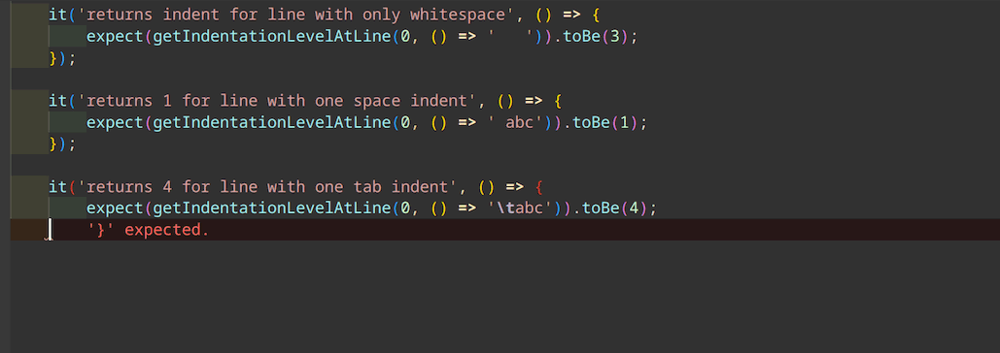

# Close Any Bracket

A Visual Studio Code extension to automatically close open braces, brackets, or parentheses in the right order.

## Features

- **Close last open (, [, or {** (default shortcut <kbd>Alt</kbd>+<kbd>]</kbd>, Mac: <kbd>Control</kbd>+<kbd>]</kbd>)
- **Close all open brackets to current indent** - Checks the indentation level for the current line and closes all unclosed `(`, `[`, or `{` at this indentation level or deeper. (default shortcut: <kbd>Alt</kbd>+<kbd>Shift</kbd>+<kbd>Enter</kbd>, Mac: <kbd>Control</kbd>+<kbd>Shift</kbd>+<kbd>Enter</kbd>)
- Supports close to 300 languages including JavaScript, TypeScript, CSS, JSON, Python, Java, Go, C/C++/C#, HTML (with embedded JavaScript or CSS).

## Limitations

- Brackets are inserted at the cursor position without any regard for aesthetics, so this works best if combined with automatic formatting.
- Some nested structures like template strings may not work well, in particular if the syntax is not valid while you're editing.
